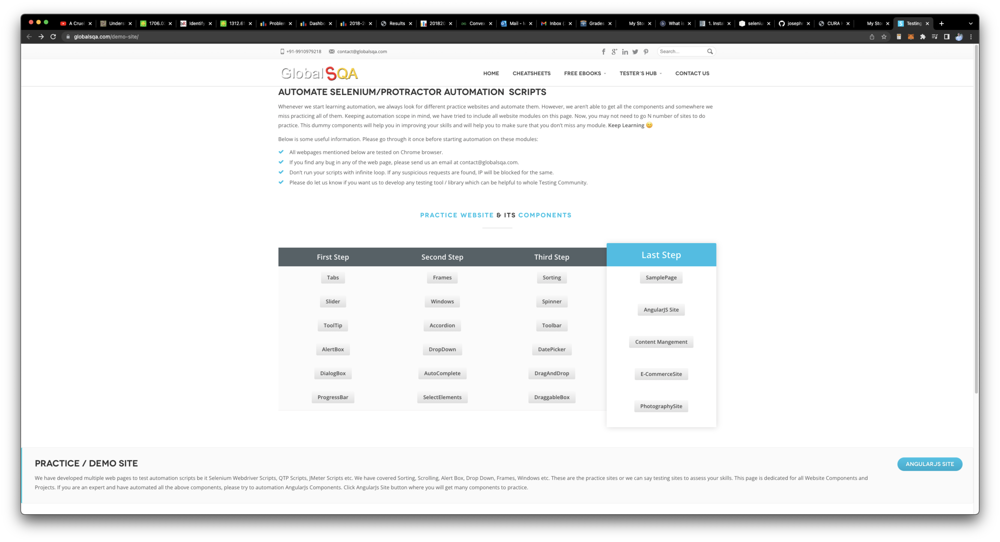

Web-testing:

Runs on the following [website](https://www.globalsqa.com/demo-site/).

To run the tests:

1. Run the command in order to create the conda environment:
`conda create -n web-testing python=3.10`

2. Run the command to install pip
`conda install pip`

3. Run the command to install the required commands
`pip3 install -r requirements.txt`

4. Run the command to install the local module to the conda environment.
`pip3 install -e .`

5. Run the tests with the command
`pytest .`